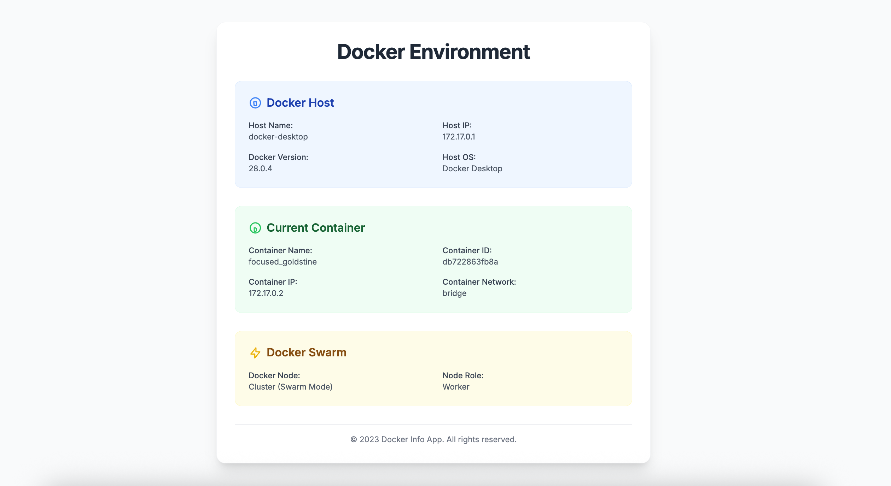

# Docker Info Web App

This is a simple Flask web application that runs inside a Docker container. It displays information about the Docker host and the container itself, including details about Docker Swarm if the host is part of a cluster.

---

## 📷 Preview


---


## Prerequisites

* Docker installed on your system.

## Project Structure
```
.
├── Dockerfile
├── entrypoint.sh
├── requirements.txt
├── app.py
└── templates/
    └── index.html

```

## How to Use

### 1. Build the Docker Image

Navigate to the project directory in your terminal and run the following command to build the Docker image. The image will be tagged as `my-docker-info-web-app`.

````
docker build -t docker-info-app .
````

### 2. Run the Container

To run the container, you **must** mount the Docker socket from your host machine. This allows the application inside the container to communicate with the Docker daemon on the host and retrieve information.

`````
docker run --rm -v /var/run/docker.sock:/var/run/docker.sock -p 8000:5000 docker-info-app

`````


* `--rm`: Automatically removes the container when it exits.

* `-v /var/run/docker.sock:/var/run/docker.sock`: Mounts the host's Docker socket into the container.

* `-p 8000:5000`: Maps port 8000 of the host to port 5000 of the container.

Once the container is running, open your web browser and navigate to `http://localhost:5000` to see the results.

### 3. Using Docker Compose

For a more streamlined workflow, you can use a `docker-compose.yml` file. This file automates the build and run steps.

First, create a `docker-compose.yml` file in the root of your project:

````
# docker-compose.yml
services:
  web:
    build: .
    image: docker-info-app
    volumes:
      - /var/run/docker.sock:/var/run/docker.sock
    ports:
      - "8000:5000"
    restart: on-failure
````


Then, from the same directory, run the following command:

````
docker compose up -d
````


This command will automatically build the image (if it doesn't exist) and start the container with the specified settings.

To stop and remove the container, press `Ctrl+C` in the terminal where the container is running and then execute:

````
docker compose down
````